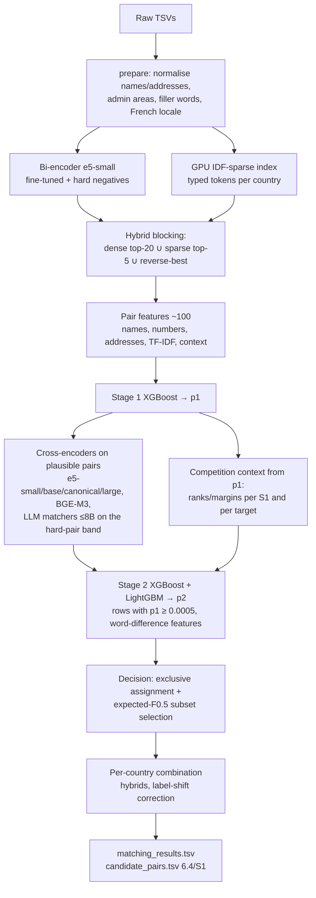

# Business Entity Resolution — Architecture & Experiment Log

Amazon ML Challenge 2026 · macro per-entity F0.5 · code in `code/business_entity_resolution/src/ber/`

This document records what the pipeline does, why each part exists, what we measured, and how the
leaderboard results shaped later versions. Numbers come from the actual runs (logs in `work/*.log`,
`work/logs/`). How to run everything: `code/business_entity_resolution/run.md`.

---

## 1. The problem in one paragraph

For every Source-1 (S1) business record, find all Source-2/Source-3 (S2/S3) records describing the same
business. The score is F0.5 computed **per S1 entity** and averaged. A correctly empty prediction for an
entity with no matches scores 1.0, and any false merge on such an entity scores 0. Precision counts
twice as much as recall. Test data contains a third country, **France**, that has no training labels.

## 2. What the data looks like (EDA)

| | S1 | S2 | S3 | Targets per S1 |
|---|---|---|---|---|
| train | 2,206,821 (US 1.32M, India 0.88M) | 5,034,616 | 5,285,603 | 4.68 |
| test | 1,732,544 (India 810K, US 663K, **France 259K**) | 4,887,273 | 5,082,316 | 5.76 (France 5.53) |

- **Links:**
  - 7,638,365 true links, 0–11 per S1 (≤5 from S2, ≤6 from S3), mean 3.46.
  - **5.59% of S1 are singletons.**
  - Copy counts per source are roughly independent and Poisson-like (13% of entities have no S2 copy).
- **Structure:**
  - Every S2/S3 record links to **at most one** S1, and **no link crosses countries**.
  - 26.6% of train S2/S3 records are unmatched.
  - Test has about twice as many unmatched records per S1, but for US/India they never come near an S1.
    The per-S1 candidate statistics on test equal validation exactly: 3.68 plausible, 3.41 accepted,
    0.26 rejected.
- The data is synthetic, and the generator's patterns are consistent:
  - **True-match noise (names):**
    - legal-suffix variants and repeats (`Inc Inc`), word shuffles, junk prefixes (`--`, `>>`, `M/s`),
      accents, OCR swaps (`Heart1and`);
    - **filler words** (`Services`, `Center`, `Partners`); in France, `France`, `& Fils`,
      `Développement`, `Groupe`, `Associés`;
    - **domain names** (`ryfoods.com`), **DBA / fka / née** (`X doing business as Y`);
    - `| www.site.com`, `(ID: 30420)`, phone numbers, non-Latin scripts.
  - **True-match noise (addresses):**
    - reordering, abbreviations, state name vs code;
    - zero-padded or truncated house numbers (`2610→02610`, `3890→890`);
    - in France, `N° 13`, `Crs`, `Q.`, `28 B` where S1 writes `13`, `Cours`, `Quai`, `28 Bis`;
    - missing address (~3%).
  - **Distractors are adversarial near-duplicates:**
    - the same name with a different house number;
    - a different legal form (`UDE Service EI` vs `UDE Service SAS`);
    - distractor words appended (`Ent`, `Traders`; in France `Participations`, `Distribution`,
      `International`, `Holding`);
    - random names at the same address.
  - **Label-free distractor test:** in the training countries, distractors essentially never keep the exact
    address. The same-address rate is **0.05% for non-matches vs 22% for matches**. This separates
    filler words from distractor words without labels.
  - **France** uses French vocabulary: names are *brand + category word + legal form*
    (`Bordeaux Union EURL`), built from a small generic vocabulary (`Club`, `Amicale`, `Comité`,
    `École`). As a result:
    - French S1s have **3× more look-alike candidates** than US ones (0.74 vs 0.26 rejected-but-plausible
      per S1; 0.36 vs 0.11 uncertain).
    - Unlike the training countries, French look-alikes *can* share the exact address. Leaderboard test
      v6b showed such pairs are only about 50% true.
    - S1 writes the *région* (`Hauts-de-France`), while S2/S3 often write the *département* (`Nord`).

## 3. Pipeline overview

### 3.1 Data split (no leakage)

Training S1 entities are split into 10 random folds (`splits.py`):
- **E = folds 0–2 (30%)** train the neural models (bi-encoder, cross-encoders).
- **R = folds 3–9 (70%)** train and validate the gradient-boosted stages with 4-fold S1-grouped
  cross-validation.

All validation scores are **out-of-fold** on R entities, over the full entity universe (singletons and
entities whose links were lost in blocking included).

### 3.2 Normalisation (`normalize.py`, `admin_areas.py`, `fillers.py`)

- **General rules:**
  - Unicode fold + `anyascii` transliteration; `&`→and; merge spelled initials (`L.L.C.`→`llc`).
  - Canonical maps for EN/IN/FR abbreviations, legal forms, and US/Indian state names → codes.
  - DBA / fka / "formerly known as" → real name kept, the other part stored as `name_alt`.
  - Domain names reduced to their stem; `| www…`, `(ID: …)` and phone numbers stripped.
  - **Consonant skeleton** key bridging transliteration (`श्री गणेश ट्रेडर्स` and `Shree Ganesh Traders`
    → `sr gns trdrs`) and OCR digit swaps.
  - **Address stopwords** (de, la, le, les, du, des, of, the, et, au, aux, en) removed.
- **French admin areas:** any address component that is a région or département becomes one région
  **code token** (`Nord`, `Pas-de-Calais`, `Hauts-de-France` → `hdf`).
- **French address locale (v8, `normalize.fr_addr`)**, found by comparing French S1 vs S2/S3 address
  token frequencies:
  - drop the `N°`/`No` house-number marker (11.5% of French target addresses);
  - `Crs`→cours, `Q`→quai, `Psg/Pass`→passage, lone `B`/`T` after a number → bis/ter,
    appartement→apt.
  - It applies to French records only, because the training countries use `no`/`cross` differently
    (Indian `kh no 570`, `1st cross`).
- **Data-driven filler words** (`fillers.py`, no labels):
  - Per split and country, tokens whose S2/S3 name document frequency is ≥1.8× the S1 one are
    generator fillers, removed to form `name_f`.
  - **v6, countries without training data:** also flag tokens whose target frequency exceeds
    shrinkage × S1 frequency by ≥0.004. This catches fillers that are also common base words
    (`France`, `Fils`, `Services`). French fillers:
    `participations, holding, developpement, associes, grp, intl, dist, snc` + `france, sons, svc`.

### 3.3 Candidate generation / blocking

| Version | Method | Train pair recall | Candidates / S1 |
|---|---|---|---|
| v1 encoder | e5-small, in-batch negatives, dense top-40 + CPU sparse | 99.935% (union, cap 60) | 120 |
| v2 encoder | + **mined hard negatives** (top non-matches of the same S1) | 99.84% (cap 20) | 40.4 |
| **v5 hybrid** | v2 dense top-20 ∪ **GPU IDF-sparse** top-5 ∪ reverse-best | **99.862%** | **45.4** |
| final candidate file (to v10) | hybrid ∩ stage-1 filter p1 ≥ 0.001, plus every predicted match | 99.833% | 6.4 |
| **final candidate file (v11)** | hybrid ∩ stage-1 filter **p1 ≥ 0.01** = exactly the pairs stage 2 scores | **99.60%** (800K held-out S1, OOF p1) | **4.7** (test) |

- **Bi-encoder** (`biencoder.py`): `intfloat/multilingual-e5-small` (MIT, 118M), symmetric InfoNCE,
  1 epoch on 2.29M E-fold pairs. A second round uses the top-3 mined hard negatives per source
  (`mine_hardneg.py`, lr 2e-5).
- **Dense search:** exact kNN on GPU within each country (country is only a partition key, never a
  feature), plus reverse kNN from each target to its closest S1 records.
- **Sparse path (v5):** on test, the encoder ranked French true matches 23× more often at rank ≥10 than
  US/India ones. An IDF index fitted on each country's own records (filler-free name tokens,
  skeletons, address tokens, house-number×street keys) recovers about 60% of that tail.
- **Blocking misses checked:** every pair with identical filler-free name and address is in the
  candidate set, in every country.
- **The final candidate file** keeps the pipeline's own stage-1 filter. Since v11 one threshold,
  `config.CAND_MIN_P1 = 0.01`, defines the stage-2 input, the cross-encoder / LLM pairs and
  `candidate_pairs.tsv`, as the rules require (the file is what the final model scores). It is
  10× smaller than the raw union (4.7 vs 46 per S1 on test). The organisers rank smaller candidate
  sets higher; v8 accepted only 440 of its 5.9M test matches below p1 = 0.01 (0.007%), so the
  26% cut from 6.4 per S1 costs essentially no F0.5 (`package_candidates.py`).

### 3.4 Pair features (`features.py`, ~100 features)

- **Names:**
  - rapidfuzz ratio / partial / token-sort / token-set / Jaro-Winkler / Levenshtein on core, full, raw,
    skeleton, no-space, DBA-alternative and **filler-free** views;
  - exact flags, token counts, and missing/extra identity tokens with typo tolerance;
  - word-IDF and char-3-gram TF-IDF cosines, fitted per country without labels.
- **Addresses:** string similarities, TF-IDF cosines, empty flag, and house-number logic (exact / prefix
  / suffix / anywhere / large-number-missing), number-set Jaccard, zip agreement.
- **Word-difference features (v8, `adapt.diff_token_feats`):**
  - within-country document frequency of the missing and extra words (common vocabulary swaps vs typos
    vs distractor words);
  - Jaro-Winkler of a one-word swap, exact same-address flag, token-set ratio.
  - They raise LightGBM validation from 0.99016 to 0.99024.
- **Other:** legal-form agreement/conflict, domain flags, name frequency (chains), dense/sparse scores
  and ranks, and **retrieval competition context** (gap and rank within the S1's list and within the
  target's claimants).

### 3.5 Matching model

- **Stage 1** (`ranker.py`): XGBoost (Apache-2.0, GPU, depth 9, η 0.08, early stopping) on all pair
  features. It is trained on 800K R entities, and a streaming pass scores every candidate
  (out-of-fold for training rows).
- **Cross-encoders** (`crossencoder.py`, `train_ce.py`, registry `ce_registry.py`) are trained on E-fold
  candidates and score pairs with p1 ≥ 0.003. Stage 2 automatically uses every model whose score file
  exists.

| Model | Backbone (licence, params) | Input | Status |
|---|---|---|---|
| `small` | multilingual-e5-small (MIT, 118M) | raw text | v1+ |
| `base` | multilingual-e5-base (MIT, 278M) | raw text | v2+ |
| `canon` | e5-small | canonical: filler-free name + legal + normalised address | v5+ |
| `large` | multilingual-e5-large (MIT, 560M) | **field-structured** raw ‖ canonical (Ditto-style), sparse hard negatives, side-swap augmentation | v8 |
| `bgem3` | BGE-M3 (MIT, 568M) | field-structured | v10 (running) |
| `large2` | e5-large, other seed, 250K entities | field-structured | DGX option |
| `qwen25_7b` | **Qwen2.5-7B (Apache-2.0, 7.6B)**, LoRA r=16, yes/no head | raw text as a yes/no question, **hard-pair band** 0.02 ≤ p1 < 0.995 | option — not used: with the e5 models the system would total 8.26B |
| `qwen3rr_4b` | **Qwen3-Reranker-4B (Apache-2.0, 4.0B)**, LoRA r=32, native yes/no head | raw text in the reranker's own template, hard-pair band | **v11** (DGX); system total 5.21B |
| `qwen3_4b` | Qwen3-4B-Base (Apache-2.0, 4.0B), LoRA r=32, yes/no head | raw text as a yes/no question, hard-pair band | option |
| `qwen15` | Qwen2.5-1.5B (Apache-2.0), full fine-tune | field-structured | option |
| `mdeberta` | mDeBERTa-v3-base (MIT) | field-structured | **excluded**: diverges to NaN after the first update (transformers 5.8, bf16 and fp32) |

  - **Decoder LLM matchers** get one prompt per pair, left padding and last-token pooling. The large ones
    use LoRA adapters on a frozen bf16 backbone (peft, Apache-2.0).
  - **Yes/no head (v11).** The pair is asked as a question ("Do records A and B describe the same
    business? Answer:", or the Qwen3-Reranker template), and the linear head starts as the LM-head
    difference of the two answer tokens, so the untrained matcher already outputs the LLM's own
    `logit(yes) − logit(no)` (checked equal to the full LM head to 1e-5). Fine-tuning starts from the
    model's multilingual judgement instead of a random direction, which is what can carry over to
    France (no labels). Zero-shot AUC on held-out hard-band pairs: 0.60 (Qwen2.5-7B base), 0.68
    (Qwen3-Reranker-4B); stage 1 reaches 0.948 on the same pairs, so the gain has to come from training.
  - **Throughput on one MIG 3g.90gb slice** (merged LoRA, bf16, SDPA): ~620 pairs/s for Qwen2.5-7B
    (~63 tokens) and ~320 pairs/s for Qwen3-Reranker-4B (~132 tokens), both ~42K tokens/s. LoRA
    training uses batch 64 (lr 2e-4): at batch 16 a step cost 1.1 s, mostly fixed overhead.
    Scoring writes its file every 1M pairs, so a job stopped by the time limit resumes.
  - The **hard-pair band** limits them to the 2.4M train / 2.2M test pairs where stage 1 is not already
    near-certain, instead of 12M / 9.5M. The same rule applies to train and test, so the feature is
    consistent.
  - Measured on 4.4M held-out pairs, the e5-large cross-encoder has AUC 0.9947, log-loss 0.089 and a
    2.71% error rate at 0.5. For comparison, e5-base has 0.9952 / 0.077 / 2.79%.
- **Stage 2:** XGBoost + LightGBM average on p1, cross-encoder scores and their context, compact pair
  features, word-difference features, and **competition features from p1**:
  - rank and margin within the S1's list;
  - margin to the best *other* claimant of the same target;
  - claimant count, best p1 in the other source, count of confident matches per S1.
  - Since v8 it runs only on rows with p1 ≥ 0.0005 (100M train rows → 16M), the same rule for train
    and test. This fixed RAM kills and also helped validation.
- **Decision** (`decide.py`): exclusive assignment, then per S1 the top-k prefix maximising expected F0.5,
  `1.25·Σp / (k + 0.25·Σp)`, against the expected score of predicting nothing. What was tried:
  - An **exact** expected-F0.5 optimiser (Poisson-binomial dynamic programming, numba) scored 0.99020
    vs 0.99023 for the approximation.
  - Temperature/bias calibration and higher floors were no better.
  - Conclusion: the decision layer is saturated.
- **Per-country combination** (`combine.py`): countries are separable (blocking, exclusivity and
  decisions never cross them). A submission can therefore take each country's probabilities from a
  different run or blend, and optionally apply a **label-shift correction**: multiply the match odds by k.
  k is estimated by the EM prior re-estimation of Saerens et al. (2002) against the training prior.
  - The EM estimate is 0.999 on validation (calibrated) and 1.03–1.18 for US/India test.
  - For France it is **0.74–0.82**: the model believes French candidates match more often than they do.

## 4. Results

### 4.1 Validation (out-of-fold macro F0.5 on held-out training entities)

| Model | OOF macro F0.5 |
|---|---|
| Stage 1 only (threshold) | 0.98371 |
| v5 stage 1 only (hybrid blocking, 800K entities) | 0.98496 |
| Stage 2 + e5-small cross-encoder (v1) | 0.98837 |
| Stage 2 + e5-small + e5-base cross-encoders (v2) | 0.98964 |
| v5 stage 2, XGBoost + LightGBM (small, base, canon) | 0.99023 |
| v5 stage 2 LightGBM + word-difference features | 0.99024 |
| **v8 stage 2: + e5-large field-structured CE + word-difference features + p1 ≥ 0.0005 rows** | **0.99077** |

**Where US/India still lose (v5 OOF, loss 0.0098):**
- **81% of the loss is missed matches.**
- The largest block is empty-address targets whose exact name is shared by ≥3 S1 records (27K misses).
  Nothing in name or address says which of those businesses owns the record.
- When exactly one S1 shares the name, the owner is that S1 96.5% of the time, and the model already
  accepts 97%.

### 4.2 Public leaderboard

| Submission | What changed | Public F0.5 |
|---|---|---|
| `v1_stage2_ce_small` | first full pipeline | 0.981244 |
| `v3_france_admin_fix` | v2 models + French région/département fix | 0.982202 |
| `v3F1_france_admin_fix_stage1` | same, France by stage 1 only (no cross-encoders) | 0.978903 |
| `v5_hybrid_blocking` | hybrid blocking, fillers, 3 CEs, XGB+LGB | 0.984567 |
| `v6_france_fillers` | + excess fillers for France (France only) | 0.985093 |
| `v6b_france_sameaddr` | v6 + accept French same-address near-name pairs | 0.985021 |
| `v8_ce_large` | e5-large CE, word-difference features, French address fix, p1 ≥ 0.0005 | **0.985164** |
| `v9a_hybrid_v8us_v6fr` | US/India from v8, France from v6 | pending |
| `v9b_fr_labelshift_em` | v9a + French odds ×0.817 (EM) | pending |
| `v9c_fr_labelshift_strong` | v9a + French odds ×0.4 | pending |
| `v9d_probe_fr_empty` | diagnostic: France empty → absolute US/India level | pending |

France is 14.98% of the S1 records, so a France-only change moves the leaderboard by
0.1498 × ΔF(France). Reading the history that way:
- **v6:** French F +0.0035 (fillers helped).
- **v6b:** French F −0.0005 (French same-address look-alikes are real distractors).
- **v8:** +0.000071 in total. Validation predicts +0.00046 from US/India, which implies French F fell
  about 0.0026. The new model and looser decision floor hurt France, and v9a separates the two parts.

### 4.3 Why the leaderboard is lower than validation (diagnosis)

- **US/India:** test candidate and confidence statistics match validation, so US/India should be about
  0.9905 (the v9d probe measures it directly). The #1 leaderboard team is at 0.9906 overall.
- **France is the gap.** The leaderboard implies French F ≈ 0.952–0.955, while the model's own estimate
  is 0.975, so the model is confidently wrong on France.
- **Label-free checks done on France:**
  - The same-address role test identified distractor words and true fillers.
  - Word swaps keep the address at the true-copy rate, but so do French look-alikes that share an
    address.
  - Look-alike names recur *less* often than in the US (9% vs 12%), so there is no sign of hidden
    other-entity clusters.
  - Street-name disagreement is not elevated.
  - EM label shift gives k ≈ 0.8.
  - **Filler list vs distractor words (v11 check).** The French filler set
    (`grp developpement intl participations dist holding snc associes` + `france sons svc`) contains
    words whose one-extra-word candidate pairs almost never keep the exact address: `intl` 0.014%,
    `dist` 0.020%, `participations` 0.032%, `holding` 0.075%, against 25% for identical French names
    and 21–24% for the real fillers `sons`, `associes`, `svc`. The test is validated on train, where
    the same-address rate of a word tracks its match rate (correlation 0.85; `ent`, `traders`,
    `ventures` ≈ 0% and 1% matches). Stage 2 already rejects these pairs, though: v8 accepts only
    120 French pairs whose sole difference is one of the four words (117 of 259K entities), so this
    is not the France gap. For the other filler words the same test splits v8's decisions (accepted
    identical French names keep the address 34% of the time): `france` is separated well (accepted
    25%, rejected 0.6%), but `grp` (Groupe) and `developpement` are inverted — rejected pairs keep the
    address 30% / 21% of the time (mostly true copies), accepted ones 13% / 12%. `grp` is a pure
    distractor word in training (0% matches in US and India), so the role learned there transfers
    wrongly. Estimated cost ≈ 0.002 French F (≈3.7K missed and 1.2K false pairs): real, but a small
    part of the gap.
- **Fixed so far:** région codes and stopwords (v5), the IDF-sparse path (v5), excess fillers (v6),
  the French address locale (v8).
- **Remaining levers:** stronger multilingual matchers (≤8B LLMs), the French decision strength
  (label-shift variants read on the leaderboard), and ensembles.

## 5. Constraints and fair play

- **Model licences and size:**
  - Every model is MIT or Apache-2.0 and ≤ 8B parameters: e5-small/base/large, BGE-M3, Qwen2.5-1.5B,
    Qwen3-4B, Qwen2.5-7B (7.6B), XGBoost, LightGBM, peft.
  - Qwen3-8B (8.2B) is deliberately not used.
- **No external data:** no APIs, geocoders or lookups. French région/département and US/Indian state
  tables are static normalisation knowledge, like abbreviation maps. Country is used only as a
  partition key.
- **Test data use:** test records are used only without labels (TF-IDF fitting, filler statistics,
  label-shift estimation). No labels or leaked data are used.

## 6. Engineering notes

- **Development machine:** 1× RTX PRO 4500 (32 GB), 48 cores, 93 GB RAM (about 30 GB held by other
  services), ~12–25 GB free disk.
- **Target machine:** 1× B200 (180 GB) for the LLM matchers, run model by model.
- **Incidents and fixes:**
  - GPU OOMs when jobs overlapped: chunked prediction and sequential GPU chains.
  - Disk-full crash: streaming passes and compact files.
  - Slow polars window functions: numpy sort-based group statistics.
  - Stage-2 RAM kills: p1 ≥ 0.0005 row filter.
  - Too many processes in the word-difference pool: fork copy-on-write with 12 workers.
  - mDeBERTa NaN: model excluded.
  - Fold models are resumable, so scripts delete stale stage-2 folds before retraining.
- **Wall times on the development GPU:**

| Task | Time |
|---|---|
| Blocking | ~1.5 h |
| Features + stage 1 | ~2 h |
| e5-large CE training (4.4M pairs) | 6.6 h |
| e5-large CE scoring (21.5M pairs) | 3.5 h |
| Stage 2 + inference | ~20 min |

## 7. How to run

See `code/business_entity_resolution/run.md`:

| Script | Purpose |
|---|---|
| `scripts/setup_env.sh` | environment setup |
| `scripts/run_pipeline.sh` | full reproduction, resumable by stage |
| `scripts/run_experiments.sh` | extra cross-encoders / LLM matchers on top of existing artefacts, stage 2 after each on a single GPU |
| `scripts/make_variants.sh` | per-country hybrids and label-shift variants |
| `scripts/package_final.sh` | final zip |
| `scripts/pack_artifacts.sh` | the file list for moving `work/` to another machine |

## 8. Repository map

| Path | Content |
|---|---|
| `code/business_entity_resolution/src/ber/` | all pipeline modules (`ce_registry.py` lists the cross-encoders) |
| `code/business_entity_resolution/scripts/` | the shell entry points above |
| `code/business_entity_resolution/reference/` | v6 French pair probabilities keyed by entity ids (12.7 MB), for hybrid variants on any machine |
| `code/business_entity_resolution/{run.md, README.md, requirements.txt, package_submission.sh}` | running, reproduction, packaging |
| `Documentation_template.md` | methodology write-up for the final zip |
| `submissions/<version>/` | every uploaded or candidate `matching_results.tsv` with `NOTES.txt` |
| `work/` | intermediates, models and logs (not part of the zip) |
| `output/` | the latest `matching_results.tsv` and `candidate_pairs.tsv` |
