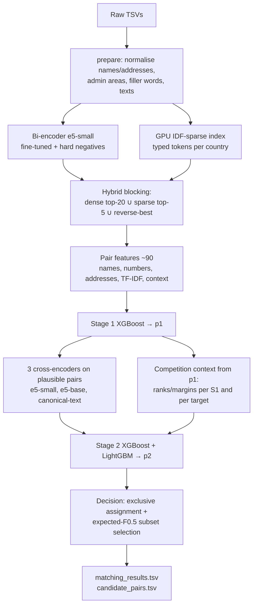

# Business Entity Resolution — Architecture & Experiment Log

Amazon ML Challenge 2026 · macro per-entity F0.5 · code in `code/business_entity_resolution/src/ber/`

This document records what the pipeline does, why each part exists, what we measured, and how the
leaderboard results shaped later versions. Numbers come from the actual runs (logs in `work/*.log`).

---

## 1. The problem in one paragraph

For every Source-1 (S1) business record, find all Source-2/Source-3 (S2/S3) records describing the same
business. The score is F0.5 computed **per S1 entity** and averaged; a correctly empty prediction for an
entity with no matches scores 1.0, and any false merge on such an entity scores 0. Precision counts
twice as much as recall. Test data contains a third country, **France**, that has no training labels.

## 2. What the data looks like (EDA)

| | S1 | S2 | S3 |
|---|---|---|---|
| train | 2,206,821 (US 1.32M, India 0.88M) | 5,034,616 | 5,285,603 |
| test | 1,732,544 (India 810K, US 663K, **France 259K**) | 4,887,273 | 5,082,316 |

- 7,638,365 true links; 0–11 links per S1 (≤5 from S2, ≤6 from S3); **5.59% of S1 are singletons**.
- Every S2/S3 record links to **at most one** S1; **no link crosses countries**; 26.6% of S2/S3 records
  are unmatched **distractors**.
- The data is synthetic, and the generator's patterns are consistent:
  - **True-match noise (names):** legal-suffix variants and repeats (`Inc Inc`), word shuffles, junk
    prefixes (`--`, `>>`, `M/s`), accents, OCR swaps (`Heart1and`), **filler words** (`Services`,
    `Center`, `Partners`), **domain names** (`ryfoods.com`), **DBA / fka** (`X doing business as Y`,
    `X fka Y`), `| www.site.com`, `(ID: 30420)`, phone numbers, non-Latin scripts (Devanagari, Bengali…).
  - **True-match noise (addresses):** reordering, abbreviations, state name vs code, zero-padded or
    truncated house numbers (`2610→02610`, `3890→890`), extra inserted numbers, missing address (~3%).
  - **Distractors are adversarial near-duplicates:** same name with a different house number
    (`Premier Financial Services Corp, 8326` vs `… Inc, 8315`), a different legal form
    (`UDE Service EI` vs `UDE Service SAS`), or chain names in many cities.
  - **France** follows the same generator with French vocabulary: names are
    *brand + category word + legal form* (`Bordeaux Union EURL`); distractors swap the category word
    (`Bordeaux Club EURL`); true matches add French fillers (`& Associés`, `Participations`,
    `Développement`, `Holding`). S1 writes the *région* (`Hauts-de-France`), S2/S3 often the
    *département* (`Nord`, `Gironde`).

## 3. Pipeline overview



### 3.1 Data split (no leakage)

Training S1 entities are split into 10 random folds (`splits.py`):
- **E = folds 0–2 (30%)** train the neural models (bi-encoder, cross-encoders).
- **R = folds 3–9 (70%)** train and validate the gradient-boosted stages with 4-fold S1-grouped
  cross-validation. All reported validation scores are **out-of-fold** on R entities, over the full
  entity universe (singletons and entities whose links were lost in blocking included).

### 3.2 Normalisation (`normalize.py`, `admin_areas.py`, `fillers.py`)

- Unicode fold + `anyascii` transliteration; `&`→and; merge spelled initials (`L.L.C.`→`llc`).
- Canonical maps for EN/IN/FR abbreviations (street/rd/ave/blvd/rue/chemin…), legal forms
  (inc, llc, pvt ltd, sarl, sas, eurl…), US and Indian state names → codes.
- DBA / fka / "formerly known as" → real name kept, other part stored as `name_alt`; domain names reduced
  to their stem; `| www…`, `(ID: …)` and phone numbers stripped.
- **Consonant skeleton** key bridging transliteration (`श्री गणेश ट्रेडर्स` and `Shree Ganesh Traders`
  → `sr gns trdrs`) and OCR digit swaps.
- **French admin areas:** any address component that is a région or département becomes one région
  **code token** (`Nord`, `Pas-de-Calais`, `Hauts-de-France` → `hdf`), like US `Tennessee`/`TN` → `tn`.
- **Address stopwords** (de, la, le, les, du, des, of, the, et, au, aux, en) removed.
- **Data-driven filler words** (`fillers.py`): per split and country, tokens whose document frequency in
  S2/S3 names is ≥1.8× that in S1 names (Latin-script names only) are generator fillers. They are removed
  to form `name_f`. No labels are used, so it works for France: learned French fillers were
  `participations, holding, developpement, associes, grp, intl, dist, snc`.

### 3.3 Candidate generation / blocking

| Version | Method | Train pair recall | Candidates / S1 |
|---|---|---|---|
| v1 encoder | e5-small, in-batch negatives, dense top-40 + CPU sparse | 99.935% (union, cap 60) | 120 |
| v2 encoder | + **mined hard negatives** (top non-matches of the same S1) | 99.84% (cap 20) | 40.4 |
| **v5 hybrid** | v2 dense top-20 ∪ **GPU IDF-sparse** top-5 ∪ reverse-best | **99.862%** | **45.4** |

- Bi-encoder (`biencoder.py`): `intfloat/multilingual-e5-small` (MIT, 118M), symmetric InfoNCE,
  1 epoch on 2.29M E-fold pairs, then a second epoch with one mined hard negative per pair (lr 2e-5).
  Hard negatives raised recall with 3 candidates per source from ~90% to 98.97%.
- Exact kNN on GPU within each country (country is only a partition key, never a feature), plus reverse
  kNN from each target to its closest S1 records.
- **Why the sparse path was added in v5:** on test, the encoder ranked French true matches 23× more often
  at rank ≥10 than US/India ones (2.17% vs 0.09%), because French generic words
  (`Amis`, `Comité`, `SARL`) look distinctive to a model trained on English/Indian text. An IDF index
  fitted on each country's own records down-weights them automatically; about 60% of that French tail is
  in the sparse top-5. Sparse documents (`retrieval.token_doc_v2`) contain filler-free name tokens,
  skeleton tokens, address tokens and house-number×street-word keys (`hs:33_prevert`).
- The GPU inverted index (`gpu_sparse.py`) expands only the postings of each query chunk's tokens and
  reduces scores with a sort-based unique + scatter-add: France S1×S2 (259K × 703K) takes ~30 s.

### 3.4 Pair features (`features.py`, ~90 features)

- **Names:** rapidfuzz ratio / partial / token-sort / token-set / Jaro-Winkler / Levenshtein on core,
  full, raw, skeleton, no-space (domains), DBA-alternative and **filler-free** views; exact flags; token
  counts; missing/extra identity tokens with typo tolerance; word-IDF and char-3-gram TF-IDF cosines
  (fitted per country on the split's own records, unsupervised).
- **Addresses:** string similarities, TF-IDF cosines, empty-address flag, and number logic built for the
  observed noise: house number exact / prefix / suffix / found-anywhere, "large number missing"
  (distractor signal), number-set Jaccard, zip agreement.
- **Other:** legal-form agreement / conflict, domain flags, name frequency within source and country
  (chains), dense and sparse scores and ranks, **retrieval competition context** (gap to the best and
  rank within the S1's list and within the target's list of S1 claimants).
- Computed in 5M-pair chunks with multiprocessing; group statistics use one numpy lexsort
  (89M rows in ~40 s; polars window functions were far too slow).

### 3.5 Matching model

- **Stage 1** (`ranker.py`): XGBoost (Apache-2.0, GPU, depth 9, η 0.08, early stopping) on all pair
  features. Trained on a random subset of R entities (500K up to v3, 800K in v5); a streaming pass then
  scores *every* candidate (out-of-fold for training-subset rows).
- **Cross-encoders** (`crossencoder.py`, `train_ce.py`) trained on E-fold candidates (positives + top-12
  hard negatives, 3.6M pairs), scoring pairs with p1 ≥ 0.003:
  - `ce`: e5-small on raw text; `ceb`: e5-base (278M, MIT) on raw text;
  - `cec` (v5): e5-small on **canonical text** (filler-free name + legal form + normalised address), so
    French inputs look like the training distribution.
- **Stage 2:** XGBoost (+ LightGBM in v5) on p1, cross-encoder scores and their context, compact pair
  features, and **competition features from p1**: rank and margin within the S1's list, margin to the
  best *other* claimant of the same target (each S2/S3 record belongs to ≤1 S1), claimant count,
  best p1 in the other source, and the count of confident matches per S1.
- **Decision** (`decide.py`): exclusive assignment (each target kept only for its best S1), then per S1
  the top-k prefix maximising expected F0.5, `1.25·Σp / (k + 0.25·Σp)`, compared with the
  expected score of predicting nothing (`Π(1−p)` × bias). Floor, bias and exclusivity are tuned on
  out-of-fold macro F0.5.

## 4. Results

### 4.1 Validation (out-of-fold macro F0.5 on held-out training entities)

| Model | OOF macro F0.5 |
|---|---|
| Stage 1 only (threshold) | 0.98371 |
| v5 stage 1 only (hybrid blocking, new features, 800K entities; log loss 0.0097 → 0.0081) | 0.98496 |
| Stage 2 + e5-small cross-encoder (v1) | 0.98837 |
| Stage 2 + e5-small + e5-base cross-encoders (v2) | **0.98964** |
| v5 stage 2, XGBoost only / LightGBM only | 0.99017 / 0.99016 |
| **v5 stage 2, XGBoost + LightGBM average (final)** | **0.99023** |

Error analysis (v1, 500K entities): 5.4K false-positive pairs, 49.1K missed pairs (3.3K lost in
blocking, 45.8K rejected by the model); most misses are targets with an empty address and a name
variant.

### 4.2 Public leaderboard

| Submission | What changed | Public F0.5 |
|---|---|---|
| `v1_stage2_ce_small` | first full pipeline | 0.981244 |
| `v3_france_admin_fix` | v2 models + French région/département fix on test | **0.982202** |
| `v3F1_france_admin_fix_stage1` | same, but France decided by stage 1 only | 0.978903 |

| `v5_hybrid_blocking` | hybrid blocking + all France fixes + 3 CEs + XGB/LGB | *pending* |

(v2 itself was not uploaded; v3 = v2 + the admin fix.) Reference points: #1 0.988419, #30 ≈ 0.9847.
v5 vs v3 on test: 15.5% of French entities changed (32.1K pairs removed, 12.3K added), about 1.4% of
US/India entities changed; predicted French empty rate rose from 4.9% to 5.4% (US/India 5.7%).

### 4.3 Why the leaderboard is lower than validation (diagnosis)

- US/India test predictions have the same confidence profile as validation (uncertain-pair share
  4.7–5.1% on test vs 4.5–5.4% out-of-fold; model-expected F 0.9905/0.9914 on test vs 0.9902/0.9917 on
  validation), so US/India are likely ≈0.989.
- France: uncertain-pair share 13.5% (2.7×), and the model expects 0.974 but the leaderboard implies
  **≈0.94**, so the model is confidently wrong on France.
- The two France-only variants isolate France: removing the cross-encoders for France *lowered* the score
  (0.9789 vs 0.9822), so the cross-encoders help overall.
- Root causes found and fixed in v5:
  1. **Addresses:** multi-token région names and French stopwords made different streets in the same city
     look ≥80% identical (95.7% of accepted French pairs fell in the "same address" bucket vs 93% for the
     US). Fixed with région code tokens and stopword removal.
  2. **Names:** unknown French fillers vs category-word swaps. Fixed with data-driven fillers,
     filler-free features and the canonical-text cross-encoder.
  3. **Blocking:** French true matches ranked low by the encoder. Fixed with the IDF-sparse path.

## 5. Constraints and fair play

- Models: multilingual-e5-small / e5-base (MIT), XGBoost (Apache-2.0), LightGBM (MIT); all ≤ 278M params.
- No external data, APIs, geocoders or lookups; French région/département and US/Indian state tables are
  static normalisation knowledge, like abbreviation maps. Country is used only as a partition key.
- Test records are used only unsupervised (TF-IDF fitting, filler statistics), never with labels.

## 6. Engineering notes

- Hardware: 1× RTX PRO 4500 (32 GB), 48 cores, 93 GB RAM, ~15 GB free disk. The disk limit drove
  streaming feature passes and compact intermediate files.
- Incidents and fixes: GPU OOMs when jobs overlapped (fixed by chunked prediction and sequential GPU
  chains), a disk-full crash during the test pass, and slow polars window functions (replaced by
  numpy sort-based group statistics). Stage training is resumable per fold.
- Wall time for a full rebuild: ~7–8 h (blocking ~1.5 h, features + stage 1 ~2 h, cross-encoder scoring
  ~2 h, stage 2 + inference ~1 h).

## 7. How to run

```bash
cd code/business_entity_resolution/src
PY=~/.venvs/ber/bin/python
$PY -m ber.prepare --split train && $PY -m ber.prepare --split test
$PY -m ber.train_biencoder                                   # v1 encoder (E folds)
#   mine hard negatives from v1 candidates -> work/train/hardneg_e.parquet, then:
$PY -m ber.train_biencoder --hard --init ../../../work/biencoder --out ../../../work/biencoder_v2 --lr 2e-5
$PY -m ber.candidates_v5 --split train && $PY -m ber.candidates_v5 --split test
$PY -m ber.eval_blocking5                                    # recall vs rule
$PY -m ber.candidates_v5 --split train --prune 20 5 && $PY -m ber.candidates_v5 --split test --prune 20 5
$PY -m ber.train_ce train --model small && $PY -m ber.train_ce train --model base --seed 1
$PY -m ber.train_ce train --model canon --seed 3
$PY -m ber.build_features subset && $PY -m ber.train_ranker stage1
$PY -m ber.build_features score --split train && $PY -m ber.build_features score --split test
for m in small canon base; do $PY -m ber.train_ce score --split train --model $m; $PY -m ber.train_ce score --split test --model $m; done
BER_LGB=1 $PY -m ber.train_ranker stage2
$PY -m ber.infer --skip-ce
python3 ../../../utils/validate_submission.py --matching ../../../output/matching_results.tsv \
    --candidate ../../../output/candidate_pairs.tsv --test-dir ../../../dataset/test --check-ids
```

`work/chain_v5.sh 20 5` runs the whole post-blocking sequence; `ber.variants` re-applies the decision
rule with per-country overrides; `ber.error_analysis` breaks down out-of-fold losses.

## 8. Repository map

| Path | Content |
|---|---|
| `code/business_entity_resolution/src/ber/` | all pipeline modules |
| `code/business_entity_resolution/README.md`, `requirements.txt`, `package_submission.sh` | reproduction and packaging |
| `Documentation_template.md` | methodology write-up for the final zip |
| `submissions/<version>/` | every uploaded or candidate `matching_results.tsv` with `NOTES.txt` and `decision.json` |
| `work/` | intermediates, models and logs (not part of the zip) |
| `output/` | the latest `matching_results.tsv` and `candidate_pairs.tsv` |
